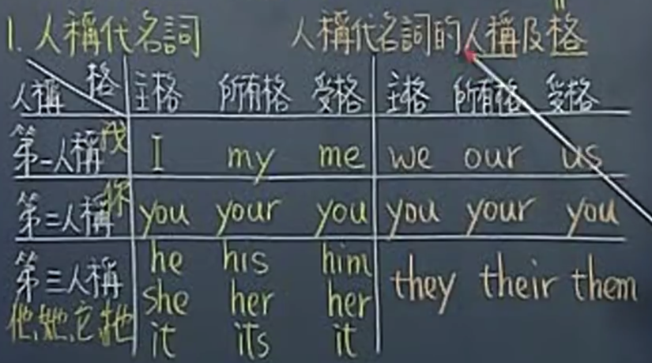

# Pronoun

## 代名词的格.

主格 + 动词 例: ___ likes sports.  
所有格 + 名词 例: ____ friends are over there.  
一般动词 + 受格/介系词+受格  
be动词 + 主格

名词的格是根据名词所处的位置来判断的.

扩展: 
有人敲门的时候用 Who is it? 因为敲门的人不在我面前, 我并没有看到他, 如果看到了一个陌生人, 问他是谁, 就需要用 Who are you.    
回答的时候, 一般用 It's I 或者 It's me. 因为 is 是 be 动词, 所以应该用 I, 但是也有好多人用 me.

## it 的用法:
### it 可表示天候, 时间, 距离...

It rains a lot in Taipei in Spring.  
It was two o'clock when he came back home.  
It is five kilometers from here to the airport.  

### it 可表示某一状况多半是说话的人以及听的人都能了解的特定状况.

A: Who knocked at the door?  
B: I thought it was Jack.  
 
It's all up to you.

I like it here

I don't feel like it.

### it 可当假主词 -> 代替一件事.

It is difficult to learn Spanish.
It's important that you should tell the truth.

